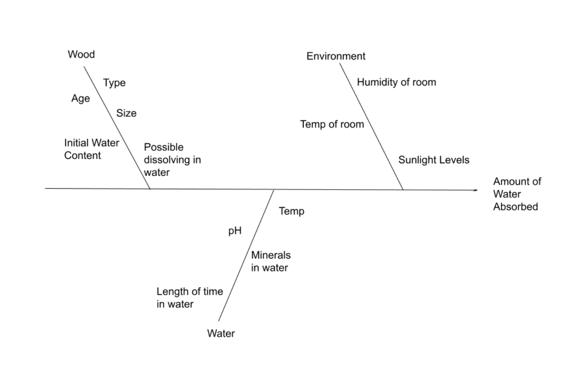
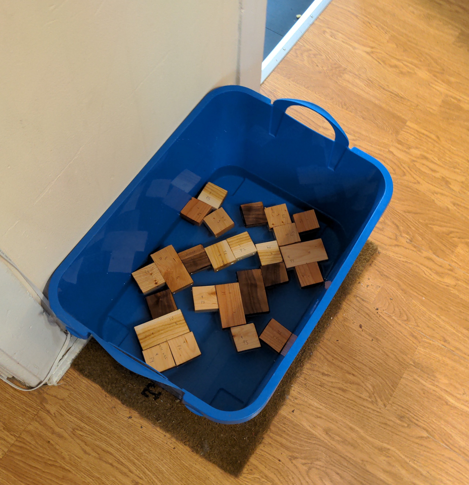

```{r setup, include=FALSE}
knitr::opts_chunk$set(echo = TRUE)
# List all libraries here
library(tidyverse)
library(knitr)
library(data.table)
```


## Introduction

A natural and sustainable building material, softwood has a variety of uses in construction and engineering. In order to advance building practices, we seek variation in moisture content of softwoods after water exposure. Softwood is hygroscopic, meaning it takes on water from its surrounding environment. The moisture content of wood impacts the viability of use in various projects. In this paper we will explore the question: what type of wood absorbs the most water?
We will measure the absorption capabilities of wood by weighing the wood before and after leaving it submerged in water for a predetermined period of time. Controllable explanatory variables that will affect this outcome include type of wood, density of wood, temperature of the water, and length of time in the water. Uncontrollable explanatory variables that will have an effect on our measurements include the pH of water, dissolved materials in the water, time since the wood was harvested, and possible dissolving of the wood in the water. In the case of the wood dissolving, we are assuming that because the wood will only be submerged for a short amount of time, any dissolving that occurs will be negligible. Other factors can be seen in the fishbone diagram below.

```{r echo=FALSE, out.width="80%", fig.align="center", fig.cap="Cause and effect fishbone diagram"}

```


Various analyses were performed on moisture content and the relation to wood samples. Our team wanted to add to this by studying the moisture content of various, well-known softwood and hardwood samples after exposure to water. While we predict the mass of each wood sample will increase after water exposure, we would like to perform an analysis of variance of the sample moisture content. Our measurement of interest is moisture content, which is operationally defined as

$MC = \dfrac{m_{wet} - m_{dry}}{m_{dry}} (100\%)$

For each of our wood types, we define a sample mean of  for each of our samples.
This leads us to our set of hypotheses:


$H_0: \mu_{Cherry} = \mu_{Walnut} = \mu_{Ash} = \mu_{Whitebirch} = \mu_{Pine}$

$H_A: \mu_{Cherry} \ne \mu_{Walnut} \ne \mu_{Ash} \ne \mu_{Whitebirch} \ne \mu_{Pine}$


To test our null and alternative hypotheses, we will use a one-way ANOVA, as well as Tukey’s HSD method, for the post-hoc comparisons.

Before any experimentation, we decided as a group to use $\alpha = 0.01$


## Methods

Design justification-

We intend to use a one way analysis of variance. While deciding on the parameters of the experiment, resources, available environment, and time were all limiting factors. Using a one way analysis of variance allows for us to compare the moisture content of various wood types while keeping the other variables constant. We will run our five wood samples with four replicates. The decision to analyze five types of wood was constrained by the resources available to us.. Further, our decision to replicate each wood type four times was made to maximize replicates while using the space and resources we had available to us. 

```{r echo=FALSE, out.width="50%", fig.align="center", fig.cap="Experiment data collection"}

```


Summary of experiment-

We used samples of Ash, Cherry, Pine, Walnut and White Birch, with each four replicates. Each replicate was a 2” square wood block. All of the specimens were left in the same bucket of water for 24 hours. Their weight was taken before and after the 24 hour time period. Because of sourcing constraints, each piece of wood is from the same plank, meaning that they might not actually be independent wood samples. Another obstacle we had to overcome was the amount of time. We let the wood sit in the water for 24 hours before measuring its mass again. This time period was chosen in order to allow a measurable moisture intake. The positioning of the wood samples in the water bath, and the order that the weights were measured were randomly selected. It was assumed that the time between pieces being weighed would not have a significant impact on differences in moisture content.


## Results and Discussion

```{r}
dat = read_csv('newdata.csv')
ggplot(dat) +
  geom_point( aes(x = Wood_Type, y = Percent_Increase)) +
  geom_hline(aes(yintercept = mean(dat$Percent_Increase)), color = "steelblue") +
  ggtitle('Percent Increase in Mass for Water Soaked Wood') +
  xlab('Wood Type') +
  ylab('Percent Increase in Mass after 24 Hours')
```


```{r}
dat <- dat %>%
  mutate(Wood_Type = case_when(Wood_Type == "Cherry" ~ 1,
                                   Wood_Type == "Walnut" ~ 2,
                                   Wood_Type == "Ash" ~ 3,
                                   Wood_Type == "White Birch" ~ 4,
                                   Wood_Type == "Pine" ~ 5)) %>%
  select(Percent_Increase, Wood_Type)
dat$Wood_Type = as.factor(dat$Wood_Type)

fit <- aov(Percent_Increase ~ Wood_Type, data = dat)
summary(fit)
```

Our P-value is 2.16e-05, which is significantly less than $\alpha = 0.01$. There exists significant evidence that we can reject $H_0$, that is, the mean moisture content is different among types. 

With a p-value of less than 0.0001, there is strong evidence against the null hypothesis. We reject that each wood type absorbs the same amount of water.

```{r}
TukeyHSD(fit, conf.level = 0.99)
```

Using Tukey's HSD and an $\alpha = 0.01$, we can see exactly which wood types differ from each other. In this case, the p-values suggest a difference in water absorption for wood 4 and 1, wood 3 and 2, wood 4 and 2, wood 5 and 3, and wood 5 and 4.  We would like to note that wood 3 and 1 would have been significant with an ALPHA = 0.05, and with more data points we potentially could have had a difference between those two at the ALPHA = 0.01 level.


We now need to check the assumptions we made for the one-way ANOVA.  Below we check the normality of each wood type. 

```{r message=FALSE,echo=FALSE ,out.width="80%", fig.align="center"}
read_csv('newdata.csv')%>%
  mutate(residuals = fit$residuals)%>%
  ggplot(aes(x = Wood_Type,residuals))+geom_point(aes(color = factor(Replicate_No)))
```

We notice that one data point sticks out, which is the low Ash data point, other than this singular data point, the residuals appear normal.  We also want to make sure that the Replicate_No didn't have an apparent effect on our results.  If we found one replicate No to have a trend, that could indicate human error (ex. spilling water onto the scale and not noticing).  We do not notice any trend between Replicates.

```{r}
setDT(dat)[,list(GroupVariance=var(rep(Percent_Increase,))), by=Wood_Type]

```
As we see above, the Ash group variance was much larger, this is the same conclusion that our residual plot lead us to.  Other than that, the group variances are just about the same given our N = 4 for each group.  Our assumption of equal variance is confirmed.


## Conclusion

We have found that Cherry, Pine or Walnut would be the best wood to use for building applications if water absorption was a major concern.  These all had equal means in water absorption, while we had enough to reject the null hypothesis that all of the means were equal, we did not have enough evidence to show that Cherry, Pine or Walnut weren't equal.  We did find that Ash and White Birch had statistically significantly different means at the level of ALPHA = 0.01.  

We may have also wanted to include blocking into our experimental design, as oftentimes the grain of a wood chunk is dictated by the wood plank or tree it was cut from.  Not every tree is going to have identical grain and therefore will also have different water absorption.  Including blocking in the form of different trees/planks might do a better job at accounting for variance between specific trees.

While this experiment made a good first look, we would recommend a supplemental study with a larger sample count per wood type.  This could potentially lead to being able to distinguish a difference in means between Cherry, Pine and Walnut.  Additionally, it may be important to look at the total amount of water absorption after an extended period of time.  There could be a case where a wood quickly absorbs water, but absorbs much less over a given time period than other wood types.  This would be an applicable study because engineering applications usually have to last for an extended period of time and our study only took into account the first 24 hours of water absorption.